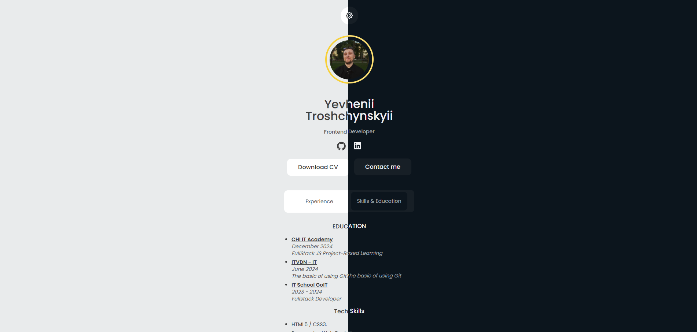

<a href="https://simple-resume-rho.vercel.app/" target="_blank" rel="noopener noreferrer"></a>

# Simple Resume Test Task

**Simple Resume** is a one-page resume website designed as a test case for the company _Scientific Alliance_. The project was implemented with an emphasis on a clean structure.

## Technologies

- **HTML5** — semantic page markup.
- **CSS3** — styling and responsive design.
- **TypeScript** — typed JavaScript to improve code quality.
- **Prettier** — code formatting to maintain a uniform style.
- **Vercel** — hosting for project deployment

## Project Structure

```bash
simple-resume-test-task/
├── public/             # Public resources (images, favicon, etc.)
│   ├──index.html       # Main HTML file
│   ├── styles/         # Style files
│   └── favicon/        # Favicon files
├── src/                # Main project code
│   ├── types.ts        # Style files
│   └── main.ts         # TypeScript entry point
├── package.json        # Dependencies and scripts
└── tsconfig.json       # TypeScript configuration
```

## Features

- _Dark mode switch (content)_ - changing the content color depending on the switch
- _Dark mode switch (favicon)_ - changing the favicon color depending on the system interface theme
- _Tabs_ - tab panels—that are displayed one at a time.

## Deploy locally

1. Clone the repository:

```bash
git clone https://github.com/uncle-Yevhenii/simple-resume.git
```

2. Go to the project directory:

```bash
cd simple-resume
```

3. Install dependencies:

```bash
npm install
```

4. Build project:

```bash
npm run build
```

5. In the generated `dist` folder, run `index.html` (I recommend using [Live Server](https://marketplace.visualstudio.com/items?itemName=ritwickdey.LiveServer), or open the file in a browser)
